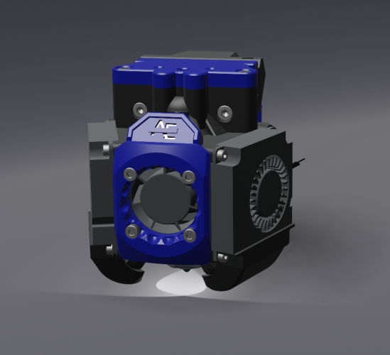
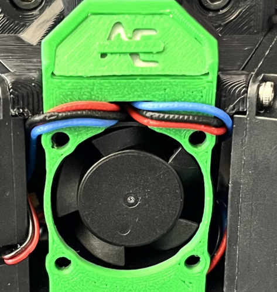
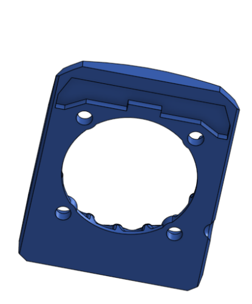
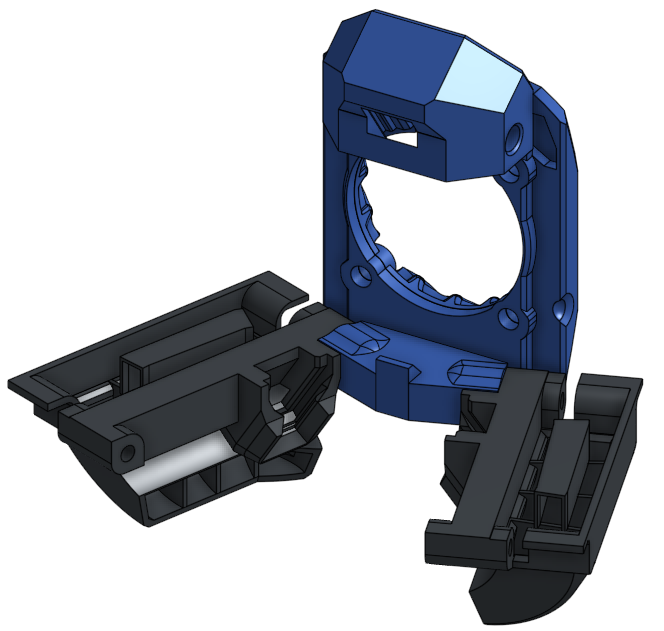

# LED mounts for Xol 2 using standard LED harness from Stealthburner

This mod uses the stock LED harness from Voron Stealthburner to add status and nozzle lights to Xol 2.

Depending on your build you will probably need a three wire extension between the Stealthburner LED harness and your toolhead board or standard wire harness.

Wires route under either side of the Xol 2 (behind a fan) and accross the 1st part of the faceplate where the status LED is inserted. Then behind the other fan before going down to the first duct. Then back accross to the other side under the 25mm hotend cooling fan behind the faceplate parts to the other duct. Look at the pictures below 😎

The cutout behind the updated front faceplate leaves space for the wires routed above the 25mm hotend cooling fan.

Only the front faceplate parts and ducts are changed from the standard hotend mounts and it uses the same m2 heatsets that would be used for stock Xol 2.

